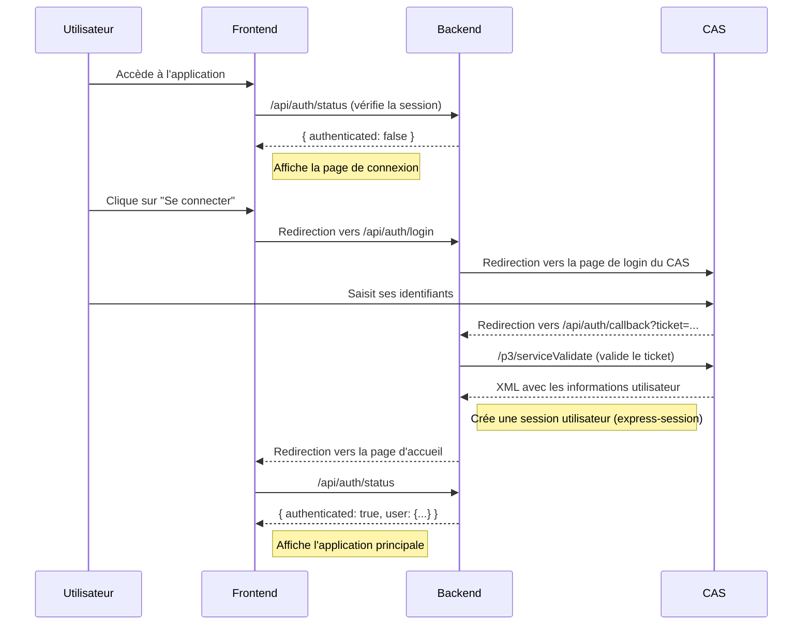
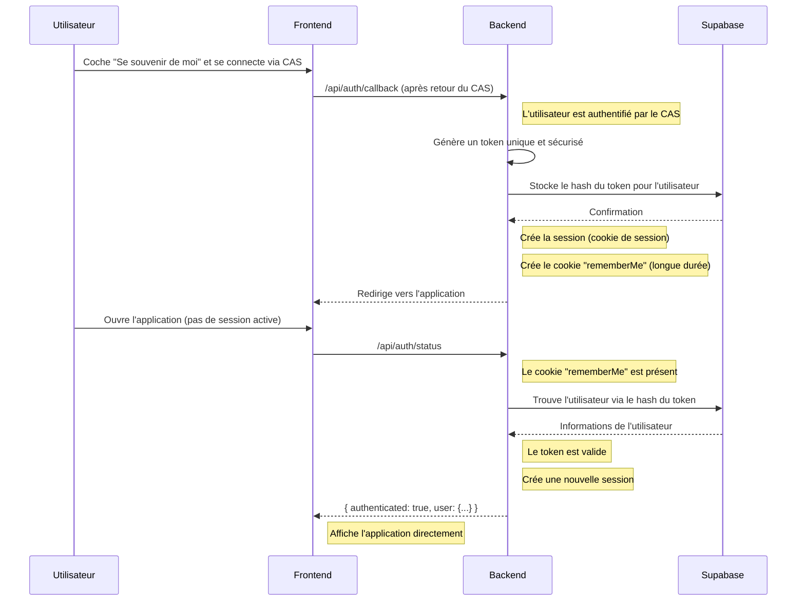

# Analyse du système d'authentification actuel

Ce document décrit le fonctionnement de l'authentification basée sur le CAS de l'application Centraliz.

## Acteurs

*   **Frontend** : L'application React qui s'exécute dans le navigateur de l'utilisateur.
*   **Backend** : Le serveur Node.js/Express qui gère la logique métier.
*   **CAS (Central Authentication Service)** : Le service d'authentification externe de Centrale Lille.
*   **Supabase** : Notre base de données, qui stockera les utilisateurs et les jetons de connexion persistante.

## Flux d'authentification initial (sans "Se souvenir de moi")

---

## Nouvelle Architecture : Connexion persistante avec Token

Pour répondre au besoin de reconnexion automatique, nous avons implémenté un système de jeton (token) persistant.

### Principes

1.  **Jeton de Souvenir** : Si l'utilisateur coche "Se souvenir de moi", le backend génère un jeton unique et sécurisé.
2.  **Stockage du Jeton** :
    *   Ce jeton est stocké dans un cookie `httpOnly` sur le navigateur de l'utilisateur, avec une longue durée de vie (ex: 30 jours).
    *   Une empreinte (hash) de ce jeton est stockée en base de données (Supabase), associée à l'utilisateur.
3.  **Reconnexion Automatique** :
    *   Au chargement de l'application, si l'utilisateur n'a pas de session active, le frontend vérifie la présence du cookie "souvenir".
    *   Si le cookie existe, le backend l'utilise pour retrouver l'utilisateur, valider le jeton, et créer une nouvelle session.

### Nouveau flux détaillé

### Implémentation

#### 1. Base de Données (Supabase)

Table `remember_me_token` :

*   `id` (uuid, clé primaire)
*   `username` (text, clé étrangère vers `users.username`)
*   `token_hash` (text, unique)
*   `expires_at` (timestamp with time zone)
*   `created_at` (timestamp with time zone)

#### 2. Backend

*   **`backend/src/services/tokenService.js`**
    *   `generateToken(username)`: Crée et stocke un nouveau token.
    *   `validateToken(token)`: Valide un token et retourne l'utilisateur associé.
    *   `deleteToken(token)`: Supprime un token de la base de données.
*   **`backend/src/routes/auth.js`**
    *   `/api/auth/status` : Vérifie la session, puis le cookie `remember_me`. Si le cookie est valide, recrée la session.
    *   `/api/auth/login` : Stocke le choix "Se souvenir de moi" dans la session.
    *   `/api/auth/logout` : Supprime le token de la base de données et efface les cookies.
*   **`backend/src/services/casService.js`**
    *   Dans `callback`, si "Se souvenir de moi" est coché :
        1.  Génère un token sécurisé.
        2.  Stocke le hash du token dans la table `remember_me_token`.
        3.  Envoie le token brut dans un cookie `remember_me`.

#### 3. Frontend

*   **`frontend/src/components/LoginPage.js`**
    *   Case à cocher "Se souvenir de moi".
    *   Passe la valeur de la case à cocher à l'URL de connexion.
*   **`frontend/src/App.js`**
    *   La logique existante dans `useEffect` pour appeler `/api/auth/status` est déjà correcte. Si le backend recrée la session grâce au token, le frontend reçoit `authenticated: true` et affiche l'application.