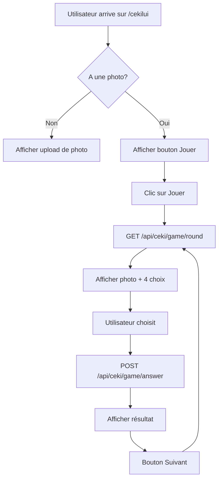

# Plan d'implémentation du jeu Cékilui - COMPLET ✅

## Architecture du jeu - IMPLÉMENTÉE

### Backend - API Routes ✅

#### 1. Route pour générer une question de jeu ✅
- **Endpoint**: `GET /api/ceki/game/round?groups=promo1,promo2`
- **Authentification**: Requise
- **Prérequis**: L'utilisateur doit avoir une photo (`hasPhoto: true`)
- **Paramètres**: `groups` (optionnel) - Liste des promos sélectionnées
- **Réponse**:
```json
{
  "success": true,
  "roundId": "unique-round-id",
  "photoUrl": "/api/ceki/photo/filename.jpg",
  "choices": [
    { "id": 1, "displayName": "Jean Dupont" },
    { "id": 2, "displayName": "Marie Martin" },
    { "id": 3, "displayName": "Pierre Durand" },
    { "id": 4, "displayName": "Sophie Leroy" }
  ]
}
```

#### 2. Route pour vérifier une réponse ✅
- **Endpoint**: `POST /api/ceki/game/answer`
- **Body**:
```json
{
  "roundId": "unique-round-id",
  "choiceId": 2
}
```
- **Réponse**:
```json
{
  "success": true,
  "correct": true,
  "correctAnswer": {
    "id": 2,
    "displayName": "Marie Martin",
    "group": "ITEEM2025"
  }
}
```

#### 3. Route pour servir les photos ✅
- **Endpoint**: `GET /api/ceki/photo/:filename`
- **Authentification**: Requise
- **Fonction**: Servir les images depuis `backend/src/data/profile-photos/`

#### 4. Route pour les statistiques des promos ✅
- **Endpoint**: `GET /api/ceki/promos-stats`
- **Authentification**: Requise
- **Réponse**:
```json
{
  "success": true,
  "promos": [
    { "group": "ITEEM2025", "count": 15 },
    { "group": "ITEEM2024", "count": 12 },
    { "group": "FISE2025", "count": 8 }
  ]
}
```

#### 5. Route pour l'upload de photos ✅
- **Endpoint**: `POST /api/ceki/upload-photo`
- **Authentification**: Requise
- **Body**: FormData avec fichier image
- **Compression**: 500x500px, qualité JPEG 90%
- **Stockage**: `backend/src/data/profile-photos/` avec nom aléatoire

#### 6. Route pour vérifier le statut photo ✅
- **Endpoint**: `GET /api/ceki/photo-status`
- **Authentification**: Requise
- **Réponse**: `{ hasPhoto: boolean, photoName: string }`

### Backend - Services ✅

#### Fonctions implémentées dans cekiService.js

1. **`checkUserPhoto(username)`** ✅
   - Vérifie si un utilisateur a une photo de profil
   - Retourne `{ hasPhoto: boolean, photoName: string }`

2. **`updateUserPhoto(username, photoName)`** ✅
   - Met à jour les informations de photo d'un utilisateur
   - Met `hasPhoto: true` et stocke le nom du fichier

3. **`getUsersWithPhotos()`** ✅
   - Récupère tous les utilisateurs ayant `hasPhoto: true`
   - Retourne `username`, `display_name`, `photoName`

4. **`getPromosStats()`** ✅
   - Récupère les statistiques des promos (nombre de personnes avec photos par promo)
   - Retourne un tableau `[{ group: string, count: number }]`

5. **`getUsersWithPhotosByGroups(selectedGroups)`** ✅
   - Récupère les utilisateurs avec photos filtrés par promos
   - Supporte le filtrage par groupes sélectionnés

6. **`generateGameRound(selectedGroups)`** ✅
   - Sélectionne un utilisateur aléatoire avec photo (filtré par promos)
   - Génère 3 autres `displayName` aléatoires (tous avec photos)
   - Mélange les 4 choix
   - Crée un `roundId` unique
   - Stocke temporairement la bonne réponse avec la promo

7. **`verifyAnswer(roundId, choiceId)`** ✅
   - Vérifie si la réponse est correcte
   - Retourne la promo de la personne
   - Nettoie les données temporaires du round

8. **`generateRandomFileName(extension)`** ✅
   - Génère un nom de fichier unique avec timestamp + hash

9. **`deletePhotoFile(photoName)`** ✅
   - Supprime un fichier photo du système de fichiers

### Frontend - Composants ✅

#### 1. Composant PhotoUploader ✅
- **Fonctionnalités**:
  - Interface avec react-avatar-editor
  - Recadrage, zoom, rotation
  - Validation des fichiers (type, taille)
  - Upload avec compression
  - Gestion d'erreurs

#### 2. Composant PromoSelector ✅
- **Fonctionnalités**:
  - Affichage des promos avec statistiques
  - Sélection multiple avec cases à cocher
  - Boutons "Tout sélectionner/désélectionner"
  - Validation (minimum 4 personnes)
  - Interface responsive

#### 3. Composant CekiluiGame ✅
- **États**:
  - `gameState`: 'menu', 'promoSelection', 'playing', 'result'
  - `selectedPromos`: Promos sélectionnées
  - `currentRound`: Données du round actuel
  - `score`: Score actuel
  - `isLoading`: État de chargement
  - `result`: Résultat de la réponse

- **Fonctions**:
  - `showPromoSelection()`: Affiche la sélection de promos
  - `startGameWithPromos(promos)`: Démarre le jeu avec promos sélectionnées
  - `loadNextRound(promos)`: Charge le prochain round
  - `submitAnswer(choiceId)`: Soumet une réponse avec feedback visuel
  - `backToMenu()`: Retour au menu principal

#### 4. Intégration dans Cekilui.js ✅
- Affichage conditionnel selon le statut photo
- Navigation fluide entre upload, jeu et menu
- Messages d'état appropriés

### Logique de génération des questions ✅

1. **Sélection de la photo**:
   - Récupérer les utilisateurs avec `hasPhoto: true` filtrés par promos
   - Sélectionner un utilisateur aléatoire
   - Utiliser sa photo comme question

2. **Génération des choix**:
   - Prendre le `displayName` de l'utilisateur sélectionné (bonne réponse)
   - Sélectionner 3 autres `displayName` aléatoires parmi les utilisateurs avec photos
   - Mélanger les 4 choix dans un ordre aléatoire

3. **Stockage temporaire**:
   - Map en mémoire pour stocker les rounds actifs
   - Clé: `roundId` (crypto.randomBytes)
   - Valeur: `{ correctChoiceId, correctDisplayName, correctGroup, photoName, timestamp }`
   - Nettoyage automatique des rounds expirés (>5 minutes)

### Sécurité ✅

1. **Authentification**: Toutes les routes nécessitent une authentification
2. **Autorisation**: Seuls les utilisateurs avec photo peuvent jouer
3. **Validation**: Vérification que le `roundId` existe et n'est pas expiré
4. **Upload sécurisé**: Validation des types de fichiers, taille limitée
5. **Noms de fichiers**: Génération aléatoire pour éviter les conflits

### Interface utilisateur ✅

#### États du jeu
1. **Pas de photo**: Message + bouton pour ajouter une photo
2. **Photo présente**: Bouton "Jouer à Cékilui" + option de remplacement
3. **Sélection promos**: Interface de sélection avec statistiques
4. **Jeu en cours**: Photo + 4 choix de noms + feedback visuel
5. **Résultat**: Affichage correct/incorrect + promo + bouton "Suivant"

#### Design ✅
- Photo centrée (300x300px, responsive 250px sur mobile)
- 4 boutons pour les choix de noms (grid 2x2, colonne sur mobile)
- Feedback visuel pour les bonnes/mauvaises réponses (animations)
- Interface stable pendant l'attente des réponses API
- Score affiché en permanence
- Styles modernes avec animations CSS

#### Fonctionnalités avancées ✅
- **Upload de photos**: Interface avec react-avatar-editor
- **Compression d'images**: 500x500px, qualité JPEG 90%
- **Sélection de promos**: Interface complète avec statistiques
- **Expérience utilisateur**: Pas de coupures pendant les requêtes API
- **Responsive design**: Adaptation mobile et desktop
- **Gestion d'erreurs**: Messages clairs et actions de récupération

### Évolutions futures

1. **Mode 10 rounds**: Partie limitée avec score final
2. **Mode chronométré**: Temps limité par question
3. **Système de points**: Points basés sur la vitesse de réponse
4. **Classements**: Leaderboard des meilleurs joueurs
5. **Statistiques**: Taux de réussite par utilisateur
6. **Mode multijoueur**: Défis entre utilisateurs
7. **Filtres avancés**: Par année, par spécialité, etc.

## Flux de données



## Implémentation par étapes

1. **Backend**: Services de jeu dans cekiService.js
2. **Backend**: Routes API dans ceki.js
3. **Backend**: Route pour servir les images
4. **Frontend**: Composant CekiluiGame
5. **Frontend**: Intégration dans Cekilui.js
6. **Frontend**: Styles CSS/SCSS
7. **Tests**: Validation du flux complet